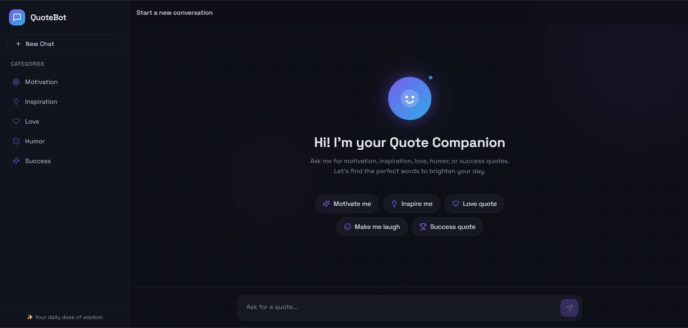

# QuoteBot – Quote Recommendation Chatbot

This project is an AI-powered chatbot that recommends motivational, inspirational, love, humor, and success quotes based on user queries.

The chatbot is built using Rasa for natural language understanding and a React-based web interface for user interaction. It allows users to request quotes through a conversational chat interface and receive meaningful responses instantly.

Technologies used:
- Rasa NLU
- Python
- React (Vite)
- Framer Motion

## Chatbot Interface

To run the project:

1. Start the Rasa action server
rasa run actions

2. Start the Rasa chatbot server
rasa run --enable-api --cors "*"

3. Run the frontend UI
cd quote-companion-ui
npm run dev